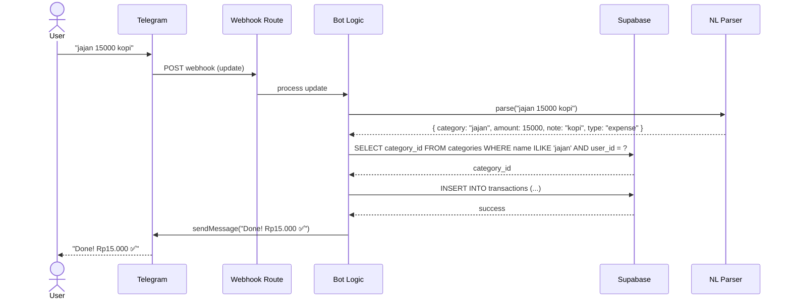
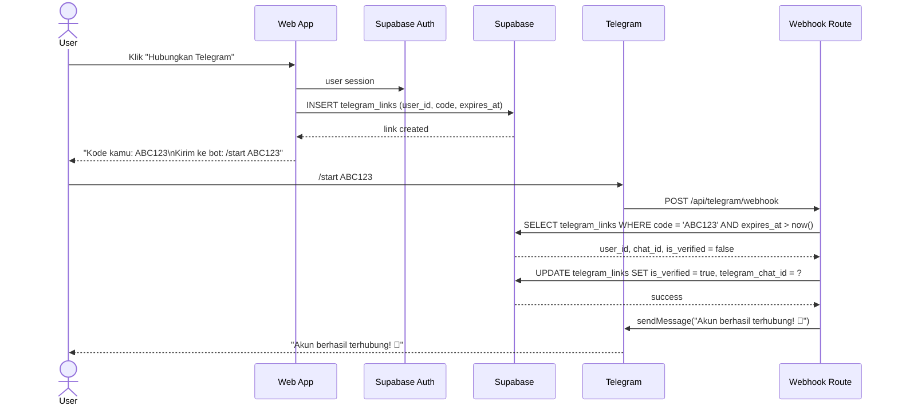
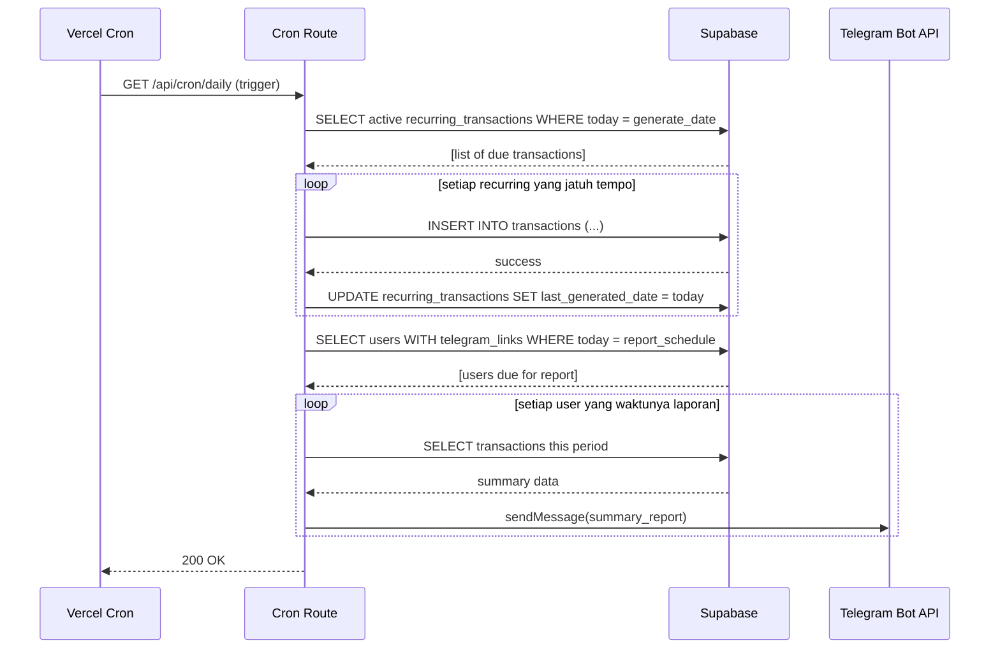

# FLOWS — PicisFlow

## 1. Sequence: Catat Transaksi via Telegram



- Jika category tidak ditemukan: balas "Kategori `jajan` gak ditemukan. Mau buat baru? [Ya] [Tidak]"
- Jika parse gagal: balas format yang didukung + contoh.

## 2. Sequence: Link Akun Web ke Telegram



- Kode: 6 karakter alfanumerik, expiry 15 menit.
- Jika kode salah/expired: "Kode tidak valid atau sudah kadaluarsa. Generate ulang di web."

## 3. Sequence: Daily Cron (Recurring + Laporan)



- Report schedule: weekly (every Monday) atau monthly (every 1st).
- Cron cek "hari ini = hari Senin?" untuk weekly, "hari ini = tanggal 1?" untuk monthly.
- Paginate laporan > 4000 karakter.

---

## 4. Folder Structure

```
src/
├── app/                          # Next.js App Router
│   ├── (auth)/
│   │   ├── login/
│   │   │   └── page.tsx
│   │   ├── register/
│   │   │   └── page.tsx
│   │   └── callback/
│   │       └── route.ts          # magic link callback (server action)
│   ├── (dashboard)/              # protected layout group
│   │   ├── dashboard/
│   │   │   └── page.tsx
│   │   ├── transactions/
│   │   │   ├── page.tsx          # list + filter
│   │   │   ├── [id]/
│   │   │   │   └── page.tsx      # edit
│   │   │   └── new/
│   │   │       └── page.tsx      # form tambah
│   │   ├── categories/
│   │   │   └── page.tsx
│   │   ├── goals/
│   │   │   └── page.tsx
│   │   ├── debts/
│   │   │   └── page.tsx
│   │   └── settings/
│   │       └── page.tsx          # link/unlink Telegram
│   ├── api/
│   │   ├── telegram/
│   │   │   └── webhook/
│   │   │       └── route.ts      # POST: webhook handler
│   │   └── cron/
│   │       └── daily/
│   │           └── route.ts      # GET: Vercel cron trigger
│   ├── layout.tsx
│   └── page.tsx                  # landing / redirect
├── components/
│   ├── ui/                       # RetroUI primitives
│   │   ├── button.tsx
│   │   ├── card.tsx
│   │   ├── input.tsx
│   │   ├── select.tsx
│   │   ├── modal.tsx
│   │   └── badge.tsx
│   ├── layout/
│   │   ├── navbar.tsx
│   │   ├── sidebar.tsx
│   │   └── shell.tsx             # layout wrapper
│   ├── transactions/
│   │   ├── transaction-form.tsx
│   │   ├── transaction-list.tsx
│   │   └── transaction-row.tsx
│   ├── categories/
│   │   └── category-picker.tsx
│   ├── charts/
│   │   ├── bar-chart.tsx         # SVG-based (no chart library)
│   │   └── pie-chart.tsx
│   └── telegram/
│       └── link-status.tsx       # Telegram connection status
├── lib/
│   ├── supabase/
│   │   ├── client.ts             # browser: createClient (anon key)
│   │   ├── server.ts             # server: createClient (service_role)
│   │   ├── middleware.ts         # auth helper
│   │   └── database.types.ts     # generated by supabase gen types
│   ├── telegram/
│   │   ├── bot.ts                # Bot instance (grammy)
│   │   ├── parser.ts             # NL pattern matching
│   │   ├── commands/
│   │   │   ├── start.ts
│   │   │   ├── catat.ts
│   │   │   ├── batal.ts
│   │   │   └── help.ts
│   │   └── keyboards.ts          # inline keyboard builders
│   ├── transactions/
│   │   └── service.ts
│   ├── reports/
│   │   └── generator.ts
│   └── utils/
│       ├── format.ts             # number formatting, date
│       └── validators.ts
├── hooks/
│   ├── use-transactions.ts
│   ├── use-categories.ts
│   └── use-user.ts
├── styles/
│   └── globals.css               # Tailwind + RetroUI overrides
└── middleware.ts                  # auth guard redirect
```

### Catatan Folder

| Folder | Peran |
|---|---|
| `app/(auth)` | Route group tanpa auth guard (login, register, callback) |
| `app/(dashboard)` | Route group dengan auth guard (semua halaman setelah login) |
| `components/ui/` | RetroUI primitives — reusable, tanpa business logic |
| `components/*/` | Feature-specific components |
| `components/charts/` | Chart SVG murni — tidak pakai library chart eksternal (zero-cost) |
| `lib/supabase/` | Supabase client instances |
| `lib/telegram/` | Bot logic — dipisah dari route handler agar testable |
| `lib/transactions/` | Business logic transaksi (shared antara web & telegram) |
| `lib/reports/` | Report generator — panggil dari cron & web |
| `hooks/` | React hooks untuk data fetching via Supabase client |

---

## 5. Catatan Teknis Penting

### Webhook Telegram
- Hanya **satu** Route Handler: `app/api/telegram/webhook/route.ts`
- Method: `POST`
- Validasi: cek HMAC header `X-Telegram-Bot-Api-Secret-Token`
- Bot instance: pake `@grammyjs/webhook` adapter
- Tidak ada polling — set `TELEGRAM_BOT_TOKEN` di env, register webhook via curl

### Vercel Cron
- Config di `vercel.json`: `{ "crons": [{ "path": "/api/cron/daily", "schedule": "0 0 * * *" }] }`
- Satu cron handler cek: (a) recurring jatuh tempo, (b) laporan terjadwal
- Guard biar ga double-proses di Vercel (Vercel cron kadang retry)

### Supabase Auto-pause
- Free project auto-pause setelah 7 hari idle
- Untuk development: hit endpoint Supabase (`/rest/v1/`) via curl tiap minggu
- Di production: aktivitas user normal akan mencegah pause

### Zero-cost Chart
- Tidak pakai Recharts/Chart.js — buat SVG manual atau pakai CSS bar
- Cukup bar chart vertikal per kategori + pie chart sederhana

### Natural Language Parsing
- Regex-only, tanpa LLM
- Format input: `<kategori> <jumlah> [catatan opsional]`
- Contoh match: `(/^([a-zA-Z\s]+?)\s+(\d+)\s*(.*)$/)`
- Jika ambigu: balas dengan pesan error + format yang benar
